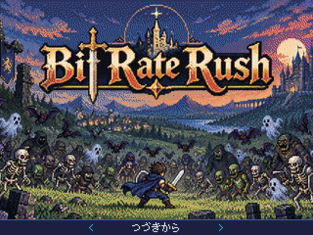
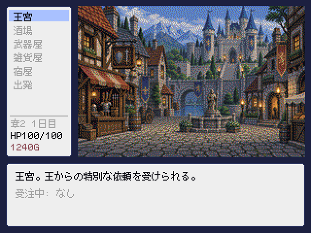
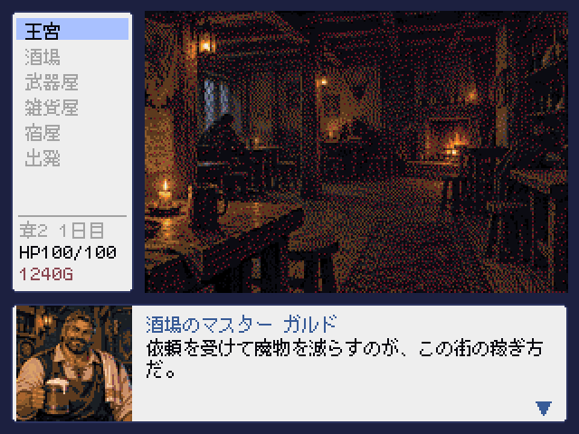
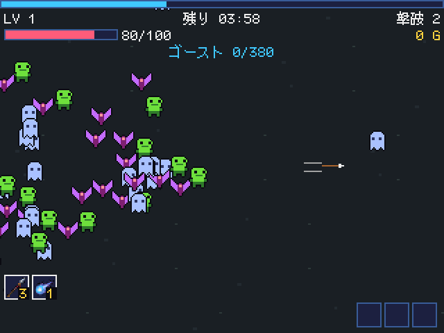
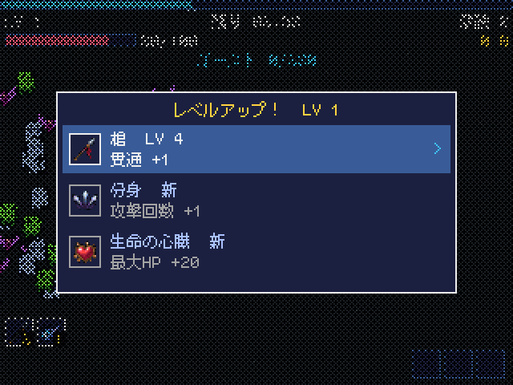
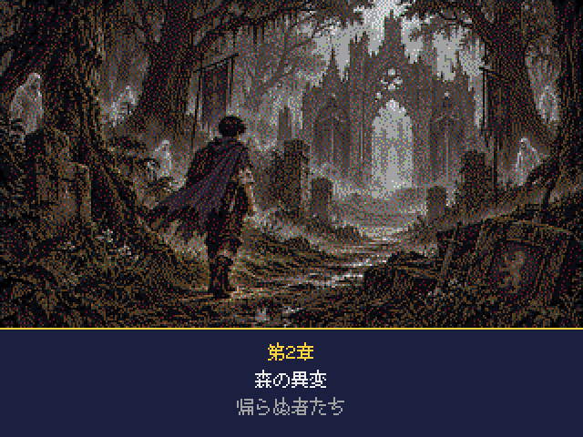
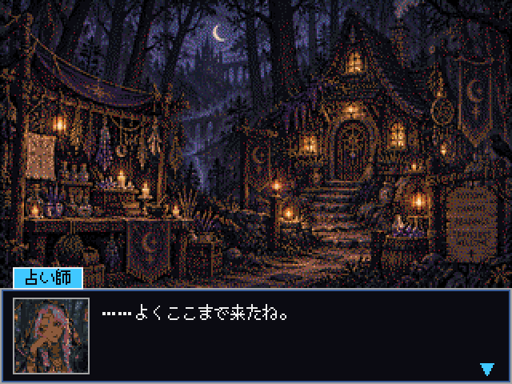

# Bit-Rate-Rush



日本語 ・ [English](README.en.md) ・ **[公式サイト](https://game-de-it.github.io/bit-rate-rush-web/)**

> **魔物の群れが押し寄せる戦場を、ナイフ一本で生き延びろ。街へ戻れば、次の依頼と物語が待っている。**

移動するだけで戦えるサバイバルアクションに、街と依頼と物語を組み合わせた 2D ドット絵 RPG。
[Pyxel](https://github.com/kitao/pyxel) 製。320×240、64 色、日本語 / 英語対応。

---

## 画面

| | |
|---|---|
|  |  |
| **城下町** — 酒場・武器屋・雑貨屋・宿屋・王宮 | **酒場** — マスターから依頼を受ける |
|  |  |
| **戦闘** — 動くだけ。武器は勝手に飛ぶ | **レベルアップ** — 3 択で武器と能力を伸ばす |
|  |  |
| **章の始まり** | **物語の場面** |

---

## どんなゲーム?

戦場でやることはひとつ、**逃げ回ること**。武器は勝手に飛び、魔法は勝手に燃える。
君が決めるのは「どこへ走るか」と「次に何を伸ばすか」だけ。

数分の戦闘を生き延びて街へ帰れば、拾った硬貨で武器を買い、宿で傷を癒やし、酒場で次の依頼を選ぶ。
そうやって一歩ずつ強くなった先に、この世界で起きている "本当のこと" が待っています。

### 世界 ― レートが上がると、ラッシュが来る

この世界の生き物は **ビット** と呼ばれる光の粒を宿しています。魔物を倒せばビットは散り、風に消える。
人は、それを拾うことができない。

そして世界には **レート** ― 流れの速さ ― があり、何者かがそれを上げるとき、眠っていた魔物は際限なく目を覚まし、群れとなって街へ押し寄せる。人々はそれを **ラッシュ** と呼び、口にすることさえ避けてきました。

今、城下町ルーメンの空を、コウモリの群れが覆いはじめています。
――若者が門をくぐった、その日から。

---

## 遊び方

### 街で
| 施設 | できること |
|---|---|
| **酒場** | 依頼板から仕事を選ぶ (生き延びる / 討伐する)。マスターの噂話も聞ける |
| **武器屋** | 硬貨で武器を買い、ランクを上げて攻撃力を伸ばす |
| **雑貨屋** | 薬草・爆弾・護符などの消耗品。持ち込めるのは 3 つまで |
| **宿屋** | 休んで回復する (有料)。日記をつける = セーブ |
| **王宮** | 王からの特別な依頼。報酬は王家に伝わる **魔導具** (魔法)。その章の酒場依頼をすべて片付けると受けられる |
| **出発** | 受けた依頼へ。初期武器と持ち物を確認して戦場へ |

### 戦場で
- **移動だけ。** 攻撃は全自動
- 敵を倒してビットを拾い、レベルアップのたびに **3 択** で武器・魔法・能力を伸ばす
- 持ち込んだアイテムは L / R で選び、Y で使う
- 依頼を達成したら **START → 帰還** で帰ってもいいし、制限時間まで戦って稼いでもいい。ただし倒れれば持ち帰りは半分
- 帰還したときの傷は、そのまま街へ持ち帰る。癒やすには硬貨がいる
- 生存依頼は残り 1 分で **ラッシュ** (出現 2 倍)。討伐依頼は目標の倍を倒すごとにボーナスの 1 分が延びる

### 物語
全 5 章。1 章は武器 1 つ、章が進むほど同時に持てる武器が増え、王宮で魔法が解放されていきます。
プレイ時間の目安は 60〜90 分。エンディングのあと、後編の導入が流れます。

---

## 操作

| 操作 | ゲームパッド | キーボード |
|---|---|---|
| 移動 | 十字キー / 左スティック | WASD / 矢印 |
| 決定 | A | Z / Enter / Space |
| キャンセル | B | X |
| ポーズ・帰還 | START | Esc |
| アイテム選択 / 使用 | L / R で選択、Y で使用 | Q / E で選択、C で使用 |
| 言語・音量 | タイトルの「オプション」(戦闘中は START → オプション) | |

---

## 動かし方

### 必要なもの
- Python 3.10 以上
- [Pyxel](https://github.com/kitao/pyxel) 2.9 以上 (`pip install pyxel`)

### 起動
```bash
python3 main.py
```
またはパッケージ版 (`Bit-Rate-Rush.pyxapp`、[Releases](../../releases) から) を:
```bash
pyxel play Bit-Rate-Rush.pyxapp
```

### 動作確認済みの環境
- macOS (Pyxel 2.9.9)
- Anbernic 系ハンドヘルド (plumOS-Bubble / RK3566、Pyxel 2.9.3)。`.pyxapp` を Pyxel の ROM フォルダに置く

### セーブデータ
Pyxel のユーザーデータ領域 (`pyxel.user_data_dir("kroot", "Bit-Rate-Rush")`) に `save.json` と `settings.json` が作られます。

---

## 開発状況

- **v1.0.0** — 前編 (ルーメン編)。本作の基本ゲームループと物語の前半
- **v1.1.0 (予定)** — 後編 (アリア編)

不具合や遊んだ感想は [Issues](../../issues) へ。バランスは公開後の感想をもとに調整していきます。

---

## ライセンス

| | |
|---|---|
| **ソースコード** | [PolyForm Noncommercial License 1.0.0](LICENSE) — **非商用目的** に限り、利用・改変・再配布できます |
| **素材** (BGM、画像、立ち絵、アイコン、物語のテキスト) | [All rights reserved](LICENSE-assets.md) — 本ゲームの一部としてのみ利用できます |
| **サードパーティ** (同梱フォント) | [THIRD-PARTY.md](THIRD-PARTY.md) |

商用利用のご相談は著作者までお問い合わせください。

**プルリクエストは現在受け付けていません。** 受け付ける場合は、その条件をここに記載します。

Copyright (c) 2026 game-de-it
